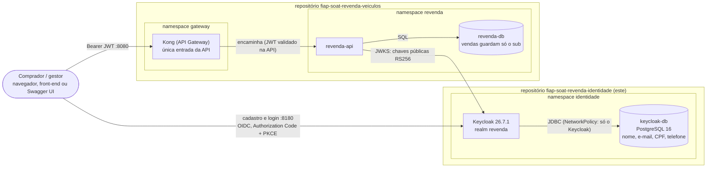
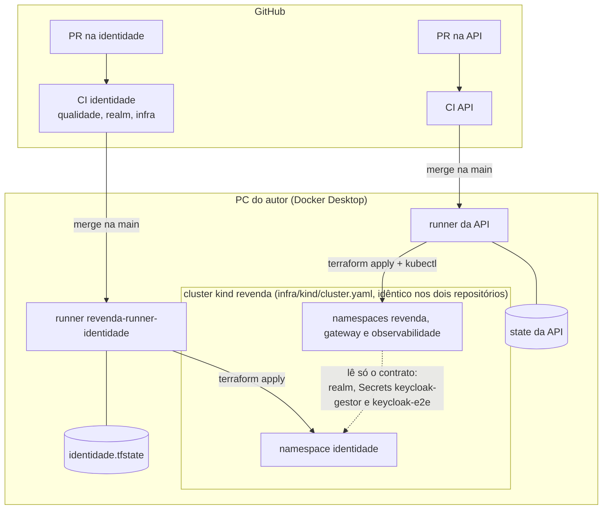

# Revenda de Veículos — Serviço de Identidade

[](https://github.com/Caina-Climaco/fiap-soat-revenda-identidade/actions/workflows/ci.yml)

Trabalho Substitutivo do Tech Challenge — FIAP PósTech Software Architecture (SOAT), Fase 3.
Autor: Cainã Clímaco (RM366473), trabalho individual.

> **Esta entrega tem dois repositórios.** Este é o do **serviço de identidade**: cadastro, login e autorização dos compradores, com Keycloak e banco próprios. A **API** de revenda (Catálogo e Vendas) está em **[fiap-soat-revenda-veiculos](https://github.com/Caina-Climaco/fiap-soat-revenda-veiculos)**. Para subir o ambiente completo, comece por **este** repositório.

Este README segue o que o enunciado pede para cada repositório: [o que é](#1-o-que-é), [como foi implementado](#2-como-foi-implementado), [como usar localmente](#3-como-usar-localmente) e [como testar](#4-como-testar).

## Sumário

1. [O que é](#1-o-que-é)
2. [Como foi implementado](#2-como-foi-implementado)
3. [Como usar localmente](#3-como-usar-localmente)
4. [Como testar](#4-como-testar)
5. [Contrato publicado](#5-contrato-publicado)
6. [CI/CD e Pull Requests](#6-cicd-e-pull-requests)
7. [Segurança e LGPD](#7-segurança-e-lgpd)
8. [Estrutura de pastas](#8-estrutura-de-pastas)
9. [Migração (de quando a identidade estava no repositório da API)](#9-migração-de-quando-a-identidade-estava-no-repositório-da-api)
10. [Limitações conhecidas](#10-limitações-conhecidas)
11. [Documentação e ADRs](#11-documentação-e-adrs)

---

## 1. O que é

O enunciado da Fase 3 pede uma API de revenda de veículos e determina:

> "O processo de registro e autorização de compradores deve ser feito de forma separada, para garantir que os dados de clientes estejam separados dos dados transacionais (...) esse serviço deve estar totalmente apartado do resto da solução."

Este repositório é esse serviço. Ele entrega um **Keycloak 26.7.1** com o realm `revenda` e um **PostgreSQL 16 exclusivo** (`keycloak-db`), implantados no namespace `identidade` do cluster kind local. É aqui que o comprador se cadastra (nome, sobrenome, e-mail, CPF e telefone), faz login e recebe um token JWT com os seus papéis.

**Por que um repositório separado.** Até a versão anterior, o Keycloak vivia dentro do repositório da API: o mesmo Terraform, o mesmo state, o mesmo pipeline. A separação física dos dados já existia (outro banco, outro namespace), mas a API ainda conhecia as credenciais de administração da identidade, e uma mudança na API podia recriar o Keycloak. Agora o serviço está **totalmente apartado**:

| | Identidade (este repositório) | API ([fiap-soat-revenda-veiculos](https://github.com/Caina-Climaco/fiap-soat-revenda-veiculos)) |
|---|---|---|
| Código | Realm do Keycloak, Terraform, testes do realm | Aplicação FastAPI, migrações, manifestos |
| Namespace no cluster | `identidade` | `revenda` |
| Banco | `keycloak-db` (dados pessoais) | `revenda-db` (sem dados pessoais) |
| Terraform e state | `infra/terraform`, `%USERPROFILE%\.revenda\identidade.tfstate` | Próprios, outro arquivo de state |
| CI | `ci.yml` (runner hospedado do GitHub) | Próprio |
| CD | `cd.yml` (runner self-hosted `revenda-runner-identidade`) | Próprio, com outro runner |

A API só consome o **contrato publicado** ([docs/contrato-identidade.md](docs/contrato-identidade.md)): o issuer, as chaves públicas (JWKS), a audiência, os papéis e dois Secrets para os testes ponta a ponta. Ela nunca recebe a senha de administração do Keycloak nem acessa o banco da identidade.

---

## 2. Como foi implementado

### 2.1 Arquitetura



Os dois serviços rodam no mesmo cluster kind `revenda`, que funciona como uma plataforma compartilhada (equivalente a uma conta de nuvem comum). Cada repositório tem o seu namespace, o seu Terraform, o seu state e o seu pipeline:



### 2.2 Realm `revenda`

O realm está versionado em [`keycloak/realm-revenda.json`](keycloak/realm-revenda.json) e é importado na inicialização do Keycloak (`start-dev --import-realm`). Os detalhes de cada item estão em [keycloak/README.md](keycloak/README.md).

- **Realm**: autocadastro habilitado, login por e-mail, e-mail único, proteção contra força bruta (10 falhas, espera crescente até 15 minutos), política de senha (mínimo de 8 caracteres, diferente do usuário e do e-mail), idioma padrão `pt-BR`, access token de 5 minutos e ação "Delete Account" habilitada (o titular pode apagar a própria conta).
- **Perfil de usuário declarativo**: usuário, e-mail, nome e sobrenome obrigatórios; `cpf` obrigatório, exatamente 11 dígitos (`^\d{11}$`); `telefone` opcional, 10 ou 11 dígitos com DDD (`^\d{10,11}$`). Os dois campos aparecem no formulário de autocadastro.
- **Papéis de realm**: `cliente` faz parte de `default-roles-revenda`, então todo usuário que se cadastra vira cliente; `gestor` é atribuído só ao usuário seed `gestor.loja` (funcionário da loja), que **não** tem o papel `cliente`.
- **Clients**:

  | Client | Tipo | Fluxo | Uso |
  |---|---|---|---|
  | `revenda-swagger` | Público | Authorization Code + PKCE S256 | Botão *Authorize* do Swagger UI da API (e qualquer front-end) |
  | `revenda-api` | Confidencial, sem fluxos | Nenhum | Existe só como **audiência** (`aud`) dos tokens |
  | `revenda-e2e` | Público | Password grant | Testes automatizados; **somente ambiente local** |
  | `revenda-e2e-admin` | Confidencial | Client credentials | Conta de serviço com apenas `manage-users`, `view-users` e `query-users`; o e2e da API cria e apaga compradores por ele; **somente ambiente local** ([ADR-004](docs/adrs/ADR-004-client-tecnico-e2e.md)) |

- **Minimização no token (LGPD)**: os clients públicos têm um mapper de audiência `revenda-api` e os escopos padrão `basic`, `roles`, `web-origins` e `acr`. Os escopos `profile` e `email` são apenas opcionais. Com `scope=openid`, o access token leva só o `sub` (identificador opaco do usuário), os papéis em `realm_access.roles`, a audiência e metadados técnicos; nunca nome, e-mail, CPF ou telefone. O CI barra a volta de `profile`/`email` aos escopos padrão.
- **Segredos fora do arquivo**: a senha do `gestor.loja` e o segredo do `revenda-e2e-admin` aparecem no JSON só como placeholders (`${GESTOR_PASSWORD}`, `${E2E_ADMIN_CLIENT_SECRET}`), que o Keycloak substitui pelas variáveis de ambiente no momento do import.

### 2.3 Infraestrutura (Terraform)

O cluster kind é criado pela CLI `kind` ([ADR-003](docs/adrs/ADR-003-plataforma-kind-compartilhada.md)); o Terraform de [`infra/terraform`](infra/terraform) cuida só do conteúdo do namespace `identidade`, com os providers `hashicorp/kubernetes` e `hashicorp/random`:

| Arquivo | Recursos |
|---|---|
| `namespaces.tf` | Namespace `identidade` |
| `secrets.tf` | Senhas aleatórias (`random_password`) e os Secrets `keycloak-db-credentials`, `keycloak-admin`, `keycloak-gestor` e `keycloak-e2e` ([ADR-002](docs/adrs/ADR-002-segredos-terraform-state-externo.md)) |
| `postgres.tf` | StatefulSet `keycloak-db` (PostgreSQL 16.15, PVC de 1 GiB, usuário não root, sistema de arquivos somente leitura) e Service `ClusterIP` |
| `keycloak.tf` | ConfigMap com o realm, Deployment `keycloak` (estratégia `Recreate`, probes em `/health/*` na porta 9000, limite de 1536 MiB), Service NodePort 30180 e Job `keycloak-reconciliar` |
| `network_policies.tf` | NetworkPolicy `keycloak-db-somente-keycloak` |
| `outputs.tf` | Contrato, URLs, nomes dos Secrets e comandos para lê-los (nenhuma saída contém senha) |

Pontos importantes:

- **Issuer fixo**: `KC_HOSTNAME=http://localhost:8180`, então o `iss` dos tokens é sempre `http://localhost:8180/realms/revenda`, mesmo quando o Keycloak é acessado por dentro do cluster. Com `KC_HOSTNAME_BACKCHANNEL_DYNAMIC=true`, as chamadas de backchannel (por exemplo, a API buscando o JWKS em `keycloak.identidade.svc.cluster.local:8080`) funcionam pelo endereço interno.
- **Reconciliação**: o import do realm usa a estratégia `IGNORE_EXISTING`, ou seja, o realm só é criado na primeira subida. Para que a senha do gestor e o segredo do client técnico nunca divirjam dos Secrets (por exemplo, numa rotação com `terraform apply -replace=random_password.keycloak_gestor`), o Terraform roda o Job `keycloak-reconciliar`. Com `kcadm.sh`, ele cria o `gestor.loja` se faltar, redefine a senha a partir do Secret, garante o papel `gestor`, remove `default-roles-revenda` e `cliente` e redefine o segredo do `revenda-e2e-admin`. O Job é recriado quando a senha, o segredo ou o Deployment do Keycloak mudam.
- **NetworkPolicy do `keycloak-db`**: o banco só aceita conexões na porta 5432 vindas de pods com o rótulo `app=keycloak` no próprio namespace. O CNI padrão do kind (kindnet) aplica NetworkPolicy desde o kind v0.24. O banco nunca é publicado no host.

---

## 3. Como usar localmente

Há duas formas. As duas publicam o Keycloak em `http://localhost:8180`, portanto **não rode as duas ao mesmo tempo**.

| | Opção A — docker compose | Opção B — cluster kind (igual ao CD) |
|---|---|---|
| Para quê | Desenvolvimento do realm, testes rápidos, API rodando no compose dela | Ambiente completo, o mesmo que o CD implanta |
| Requer | Docker | Windows, Docker Desktop, kind, Terraform, kubectl, gh |
| Segredos | Você define no `.env` | Gerados pelo Terraform, lidos com `kubectl` |

### 3.1 Opção A — docker compose

```bash
cp .env.example .env      # PowerShell: Copy-Item .env.example .env
# edite o .env e troque todos os valores "troque-..." (o .env é ignorado pelo Git)
docker compose up -d --wait
```

O compose sobe o `keycloak-db` numa rede interna, sem porta no host, e o Keycloak em `127.0.0.1:8180`. O realm é importado só na primeira subida e fica no volume `keycloak-db`; para recomeçar do zero, `docker compose down -v`.

| Serviço | Endereço |
|---|---|
| Keycloak | http://localhost:8180 |
| Console admin (realm `master`) | http://localhost:8180/admin/ — `KC_BOOTSTRAP_ADMIN_USERNAME` e `KC_BOOTSTRAP_ADMIN_PASSWORD` do `.env` |
| Discovery do realm | http://localhost:8180/realms/revenda/.well-known/openid-configuration |
| Conta do cliente (cadastro pelo link "Registre-se") | http://localhost:8180/realms/revenda/account |
| Usuário gestor | `gestor.loja` (ou `gestor@revenda.local`), senha `GESTOR_PASSWORD` do `.env` |

Senhas no `.env`: use letras e dígitos. `GESTOR_PASSWORD` aceita também `!#%*-_=+`, mas não aspas, `$`, `{` ou `}`, porque o valor é substituído no texto do arquivo de realm antes de o JSON ser lido.

A API, no `docker-compose.yml` dela, valida os tokens com o issuer `http://localhost:8180/realms/revenda` e busca o JWKS por `http://host.docker.internal:8180/...`, ou seja, neste Keycloak.

### 3.2 Opção B — cluster kind no Windows

**Pré-requisitos**: Windows 10/11, Docker Desktop (com o `kubectl` que ele instala), kind, Terraform, gh (autenticado com `gh auth login`) e git. Portas livres em `127.0.0.1`: 8080 (Kong/API), 8180 (Keycloak), 15432 (banco da API), 3000 (Grafana) e 9090 (Prometheus) — as cinco do `infra/kind/cluster.yaml`, que é compartilhado com a API. Rode na raiz do repositório, em PowerShell normal (sem administrador), por exemplo `powershell -ExecutionPolicy Bypass -File .\scripts\windows\04-subir-ambiente.ps1`.

| # | Script | O que faz |
|---|---|---|
| 00 | `scripts\windows\00-verificar-ambiente.ps1` | Relatório de ferramentas, Docker, clusters kind, `gh auth` e portas em uso (`.setup\relatorio-ambiente.txt`) |
| 01 | `scripts\windows\01-instalar-ferramentas.ps1` | Instala o que falta via winget (kind, Terraform, Helm) e inicia o Docker Desktop |
| 02 | `scripts\windows\02-criar-repositorio.ps1` | Cria este repositório no GitHub, faz o push, aplica a proteção da `main` (checks `qualidade`, `realm` e `infra`), squash only, aprovação para workflows de forks e o environment `local`. Uma vez, pelo dono |
| 03 | `scripts\windows\03-instalar-runner.ps1` | Constrói a imagem do runner (`infra/runner`) e sobe o container `revenda-runner-identidade` na rede docker `kind`, registrado **neste** repositório (labels `self-hosted`, `Linux`, `kind-local`). Precisa do cluster. `-Remover` desfaz |
| 04 | `scripts\windows\04-subir-ambiente.ps1` | Cria o cluster kind `revenda` se faltar e aplica o Terraform da identidade com o mesmo state do CD; mostra pods, o contrato e como ler a senha do gestor |
| 05 | `scripts\windows\05-destruir-ambiente.ps1` | `terraform destroy` da identidade e remoção do state (os usuários cadastrados são perdidos). Pede confirmação; `-Forcar` não pede; `-ApagarCluster` apaga também o cluster inteiro, **derrubando a API junto** |

Ordem na primeira vez: **00 → 01 → 02 → 04 → 03**. Depois disso, cada merge na `main` dispara o CD, que faz o mesmo que o script 04 e ainda roda os testes do realm contra o ambiente. Também é possível disparar o CD à mão:

```powershell
gh workflow run cd.yml -R Caina-Climaco/fiap-soat-revenda-identidade
gh run watch -R Caina-Climaco/fiap-soat-revenda-identidade
```

**Ordem do ambiente completo**: identidade primeiro (este repositório), depois a API. O CD da API falha cedo se o realm `revenda` não responder em `http://localhost:8180`.

**Senha do `gestor.loja`** (PowerShell):

```powershell
$b = kubectl -n identidade get secret keycloak-gestor -o jsonpath="{.data.GESTOR_PASSWORD}"
[Text.Encoding]::UTF8.GetString([Convert]::FromBase64String($b))
```

bash (Git Bash ou Linux):

```bash
kubectl -n identidade get secret keycloak-gestor -o jsonpath='{.data.GESTOR_PASSWORD}' | base64 -d
```

O mesmo vale para a senha do console admin (Secret `keycloak-admin`, chave `KC_BOOTSTRAP_ADMIN_PASSWORD`, usuário `admin`). Os comandos também estão no output `comandos_segredos` do Terraform.

| Item | Endereço (só em `127.0.0.1`) |
|---|---|
| Keycloak | http://localhost:8180 |
| Console admin | http://localhost:8180/admin/ |
| Conta do cliente | http://localhost:8180/realms/revenda/account |
| Issuer | http://localhost:8180/realms/revenda |

Comandos úteis: `kubectl -n identidade get pods,svc,jobs -o wide`, `kubectl -n identidade logs deployment/keycloak --tail=100`, `kubectl -n identidade logs job/keycloak-reconciliar`.

---

## 4. Como testar

Os testes ficam em [`tests/test_realm.py`](tests/test_realm.py) (marcador `realm`) e rodam contra um **Keycloak real**: no CI, contra o `docker-compose.yml` com segredos efêmeros; no CD, contra o Keycloak implantado no cluster. Eles dependem só de `pytest` e `httpx`, sem nenhum código da API.

| Teste | O que garante |
|---|---|
| `test_discovery_publica_issuer_e_jwks` | O discovery publica o issuer `http://localhost:8180/realms/revenda` e o JWKS tem uma chave RS256 de assinatura |
| `test_token_do_gestor_tem_papel_gestor_audiencia_e_nenhum_dado_pessoal` | O token do `gestor.loja` tem `iss` correto, `aud` com `revenda-api`, papel `gestor` sem `cliente`, `sub` UUID e nenhum dado pessoal |
| `test_cliente_cadastrado_recebe_papel_cliente_e_token_sem_dados_pessoais` | Um usuário novo recebe o papel `cliente` (e não `gestor`), o token não tem dados pessoais, o `sub` é o id do usuário e CPF e telefone existem só no Keycloak |
| `test_perfil_rejeita_cpf_ausente_ou_invalido_e_telefone_invalido` (3 casos) | O perfil recusa CPF ausente, CPF com menos de 11 dígitos e telefone fora do formato |
| `test_formulario_de_autocadastro_pede_cpf_e_telefone` | O formulário de cadastro do client `revenda-swagger` tem os campos `cpf` e `telefone` |
| `test_client_tecnico_do_e2e_tem_privilegio_minimo` | O `revenda-e2e-admin` lista usuários do realm `revenda`, mas não lê clients nem acessa o realm `master`, e o token dele não serve para a API |

Variáveis de ambiente:

| Variável | Obrigatória | Valor |
|---|---|---|
| `GESTOR_PASSWORD` | sim | Senha do `gestor.loja` |
| `E2E_ADMIN_CLIENT_SECRET` | sim | Segredo do client `revenda-e2e-admin` |
| `KEYCLOAK_URL` | não | Padrão `http://localhost:8180` |
| `OIDC_ISSUER_ESPERADO` | não | Padrão `http://localhost:8180/realms/revenda` |

### 4.1 Localmente, com docker compose

bash:

```bash
cp .env.example .env                     # troque os valores
docker compose up -d --wait
python -m pip install -r tests/requirements.txt
set -a; . ./.env; set +a                 # exporta GESTOR_PASSWORD e E2E_ADMIN_CLIENT_SECRET
export KEYCLOAK_URL=http://localhost:8180
python -m pytest tests -m realm
docker compose down -v                   # opcional: apaga o realm e os usuários de teste
```

PowerShell:

```powershell
Copy-Item .env.example .env              # troque os valores
docker compose up -d --wait
python -m pip install -r tests/requirements.txt
Get-Content .env | Where-Object { $_ -match '^[A-Z_]+=' } | ForEach-Object {
  $nome, $valor = $_ -split '=', 2; Set-Item "env:$nome" $valor
}
$env:KEYCLOAK_URL = "http://localhost:8180"
python -m pytest tests -m realm
```

Os testes criam usuários `teste-<aleatório>` e os apagam no final da sessão.

### 4.2 Contra o cluster kind

Com o ambiente da opção B no ar, os mesmos testes rodam a partir do Windows, lendo os segredos do cluster:

```bash
export GESTOR_PASSWORD="$(kubectl -n identidade get secret keycloak-gestor -o jsonpath='{.data.GESTOR_PASSWORD}' | base64 -d)"
export E2E_ADMIN_CLIENT_SECRET="$(kubectl -n identidade get secret keycloak-e2e -o jsonpath='{.data.E2E_ADMIN_CLIENT_SECRET}' | base64 -d)"
python -m pytest tests -m realm
```

### 4.3 O que o CI e o CD rodam

| Pipeline | Verificações |
|---|---|
| CI, job `qualidade` | Contrato do realm com `jq` (nome, autocadastro, força bruta, papéis, clients, escopos sem `profile`/`email`, segredos só por placeholder, privilégio mínimo do client técnico); `ruff check` e `ruff format --check` dos testes; Trivy de segredos no repositório |
| CI, job `realm` | Gera um `.env` com segredos aleatórios, `docker compose up -d --wait` e `pytest tests -m realm` contra o Keycloak real |
| CI, job `infra` | `terraform fmt -check`, `terraform init -backend=false` e `validate`; `infra/kind/cluster.yaml` (nome, portas, imagem por digest); hadolint no Dockerfile e shellcheck no entrypoint do runner |
| CD, job `deploy` | Após o `terraform apply`, espera o discovery do realm e roda `pytest tests -m realm` contra o cluster, com os segredos lidos dos Secrets; o resultado vai para o job summary |

---

## 5. Contrato publicado

Resumo do que os consumidores (hoje, a API) podem usar. O contrato completo, com as regras de mudança, está em **[docs/contrato-identidade.md](docs/contrato-identidade.md)**.

| Item | Valor |
|---|---|
| Issuer (`iss`) | `http://localhost:8180/realms/revenda` |
| Discovery | `http://localhost:8180/realms/revenda/.well-known/openid-configuration` |
| JWKS no cluster | `http://keycloak.identidade.svc.cluster.local:8080/realms/revenda/protocol/openid-connect/certs` |
| JWKS no host | `http://localhost:8180/realms/revenda/protocol/openid-connect/certs` |
| Assinatura | RS256 |
| Audiência (`aud`) | `revenda-api` |
| Claims garantidas | `sub`, `realm_access.roles`, `iss`, `aud`, `azp`, `exp`, `iat` |
| Claims que nunca vêm (com `scope=openid`) | nome, e-mail, username, CPF, telefone |
| Papéis | `cliente` (comprador, padrão do autocadastro), `gestor` (funcionário da loja) |
| Clients | `revenda-swagger`, `revenda-api` (audiência), `revenda-e2e` e `revenda-e2e-admin` (só local) |
| Secrets para o CD da API | `identidade/keycloak-gestor` (`GESTOR_PASSWORD`), `identidade/keycloak-e2e` (`E2E_ADMIN_CLIENT_ID`, `E2E_ADMIN_CLIENT_SECRET`) |

O mesmo resumo é o output `contrato` do Terraform, que o script 04 mostra ao final.

---

## 6. CI/CD e Pull Requests

Toda mudança entra por Pull Request. A `main` é protegida: PR obrigatório, checks `qualidade`, `realm` e `infra` obrigatórios com a branch atualizada, histórico linear, sem force push, regras valendo também para administradores e só squash merge. O título do PR segue Conventional Commits (job `titulo-pr`, informativo).

- **CI** ([`ci.yml`](.github/workflows/ci.yml)): runner hospedado do GitHub (`ubuntu-latest`), em todo PR para a `main` e em todo push na `main`, sem segredos e sem acesso ao cluster.
- **CD** ([`cd.yml`](.github/workflows/cd.yml)): runner self-hosted em container Linux no Docker Desktop do PC do autor ([ADR-005](docs/adrs/ADR-005-runner-self-hosted-container.md)), só em push na `main` ou disparo manual de um commit que já está na `main`. Cria o cluster se faltar, aplica o Terraform, espera o realm, roda os testes do realm e publica um resumo. Rollback: *Actions > CD > Run workflow* com `ref` igual a um SHA anterior da `main`.
- **Abrir PR**: `scripts\windows\abrir-pr.ps1 -Branch feat/minha-mudanca -Titulo "feat(realm): ..." -Acompanhar`.

Detalhes em **[docs/ci-cd.md](docs/ci-cd.md)**.

---

## 7. Segurança e LGPD

**O que fica aqui.** Nome, sobrenome, e-mail, CPF, telefone e o hash da senha de cada comprador ficam **só** no `keycloak-db`. O titular consulta e edita os próprios dados na página de conta (`/realms/revenda/account`) e pode apagar a conta (ação "Delete Account").

**O que a API guarda.** Apenas o `sub` do token, um identificador opaco, como `comprador_id` da venda. O token não carrega dados pessoais e a API não tem credencial para o banco nem para a administração da identidade. A ligação entre uma venda e uma pessoa só pode ser refeita com a informação mantida separadamente aqui, o que aplica o princípio da necessidade (LGPD, art. 6º, III) ao banco transacional.

Controles deste repositório:

- banco da identidade sem porta no host e protegido por NetworkPolicy (só o Keycloak conecta);
- portas do host só em `127.0.0.1`;
- todos os segredos gerados pelo Terraform, guardados apenas no state local e nos Secrets do cluster; no CI, segredos efêmeros gerados a cada execução; varredura de segredos com Trivy em todo PR ([ADR-002](docs/adrs/ADR-002-segredos-terraform-state-externo.md));
- a credencial de administração do realm `master` nunca sai deste repositório; o e2e da API usa o client `revenda-e2e-admin`, com privilégio mínimo ([ADR-004](docs/adrs/ADR-004-client-tecnico-e2e.md));
- containers sem root, sem escalada de privilégio, sem capabilities e com perfil seccomp `RuntimeDefault`; token da service account do Kubernetes não montado.

Mais em [docs/contrato-identidade.md, seção Segurança](docs/contrato-identidade.md#9-segurança). A análise completa de ameaças e de LGPD da solução está no [docs/07 da API](https://github.com/Caina-Climaco/fiap-soat-revenda-veiculos/blob/main/docs/07-seguranca-lgpd.md).

---

## 8. Estrutura de pastas

```text
.
├── keycloak/
│   ├── realm-revenda.json     # realm revenda (papéis, perfil, clients, usuário seed)
│   └── README.md              # detalhes do realm e da reconciliação
├── infra/
│   ├── kind/cluster.yaml      # cluster kind compartilhado (idêntico no repositório da API)
│   ├── terraform/             # namespace identidade, Secrets, keycloak-db, Keycloak, NetworkPolicy
│   └── runner/                # imagem do runner self-hosted (Dockerfile, entrypoint.sh)
├── tests/
│   ├── conftest.py            # cliente HTTP do Keycloak, criação e limpeza de usuários de teste
│   ├── test_realm.py          # contrato do realm (marcador realm)
│   ├── pytest.ini
│   └── requirements.txt       # pytest, httpx
├── scripts/windows/           # 00 a 05 e abrir-pr.ps1 (PowerShell 5.1, ASCII)
├── docs/
│   ├── contrato-identidade.md # contrato com os consumidores
│   ├── ci-cd.md               # pipelines, runner, proteção da main
│   └── adrs/                  # ADR-001 a ADR-005
├── .github/                   # ci.yml, cd.yml, dependabot, template de PR, actionlint
├── docker-compose.yml, .env.example
└── ruff.toml
```

---

## 9. Migração (de quando a identidade estava no repositório da API)

Quem já subiu o ambiente na versão anterior (Keycloak dentro do repositório da API) tem um cluster com os dois namespaces gerenciados por um único state, `%USERPROFILE%\.revenda\terraform.tfstate`. Esse state não serve para nenhum dos dois repositórios novos. O caminho mais simples é recomeçar do zero (os usuários cadastrados são perdidos):

1. Apague o cluster antigo e o state antigo (PowerShell):
   ```powershell
   kind delete cluster --name revenda
   Remove-Item "$env:USERPROFILE\.revenda\terraform.tfstate*" -Force
   ```
   Se o runner antigo da API estiver registrado, siga também o README da API para reinstalá-lo.
2. Neste repositório: `02-criar-repositorio.ps1` (se ainda não existe no GitHub), `04-subir-ambiente.ps1` e `03-instalar-runner.ps1`.
3. No repositório da API: siga o [README da API](https://github.com/Caina-Climaco/fiap-soat-revenda-veiculos#readme), que sobe só o namespace `revenda` com o state dela e consome o contrato publicado aqui.

O script 04 avisa se encontrar o `terraform.tfstate` antigo.

---

## 10. Limitações conhecidas

- **Keycloak em `start-dev`**: HTTP, sem cache distribuído, uma réplica. Adequado ao ambiente local, não a produção.
- **Clients só de teste**: `revenda-e2e` (password grant) e `revenda-e2e-admin` existem só no ambiente local e devem ser removidos em produção.
- **CPF sem unicidade garantida**: o perfil valida o formato, mas o Keycloak não impede o mesmo CPF em duas contas; o identificador único é o e-mail. O CPF também é editável pelo próprio usuário.
- **Recuperação de senha e verificação de e-mail desligadas**: não há servidor de e-mail no ambiente local.
- **Mudanças no realm não chegam a um realm existente**: o import é `IGNORE_EXISTING`. Uma mudança no `realm-revenda.json` exige recriar a identidade (05 e depois 04) ou aplicá-la pela Admin API ([docs/contrato-identidade.md](docs/contrato-identidade.md#8-como-o-contrato-muda)).
- **State local sem locking**: compartilhado entre o script 04 e o CD por bind mount; contém os segredos em texto claro.
- **CD depende do PC ligado**: com o runner fora do ar, o deploy fica na fila.

---

## 11. Documentação e ADRs

| Documento | Conteúdo |
|---|---|
| [docs/contrato-identidade.md](docs/contrato-identidade.md) | Contrato formal com os consumidores e controles de segurança |
| [docs/ci-cd.md](docs/ci-cd.md) | CI, CD, runner self-hosted, proteção da `main`, fluxo de PR |
| [keycloak/README.md](keycloak/README.md) | Configuração do realm e reconciliação |
| [docs/adrs/](docs/adrs/README.md) | Decisões de arquitetura |

| ADR | Decisão |
|---|---|
| [ADR-001](docs/adrs/ADR-001-keycloak-identidade.md) | Keycloak como serviço de identidade apartado |
| [ADR-002](docs/adrs/ADR-002-segredos-terraform-state-externo.md) | Segredos gerados pelo Terraform e state fora do repositório |
| [ADR-003](docs/adrs/ADR-003-plataforma-kind-compartilhada.md) | Plataforma kind compartilhada, criada pela CLI kind, com namespace e state por repositório |
| [ADR-004](docs/adrs/ADR-004-client-tecnico-e2e.md) | Client técnico `revenda-e2e-admin` para os testes da API |
| [ADR-005](docs/adrs/ADR-005-runner-self-hosted-container.md) | Runner self-hosted em container Linux, um por repositório |

---

**Autor**: Cainã Clímaco (RM366473) — FIAP PósTech Software Architecture (SOAT), Trabalho Substitutivo do Tech Challenge, Fase 3.
Repositório da API: https://github.com/Caina-Climaco/fiap-soat-revenda-veiculos
